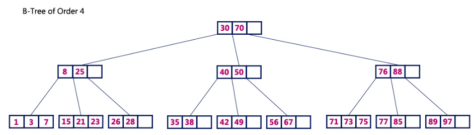
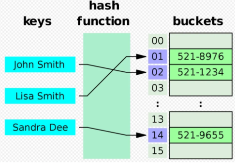
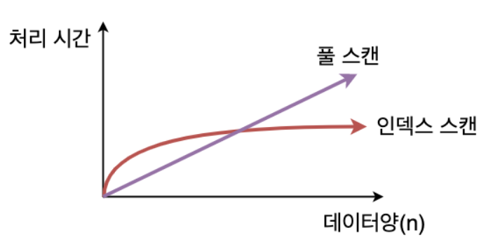

# 📌 Index
- **인덱스(Index)는 데이터 검색 속도를 향상시키기 위해 사용되는 데이터베이스 객체임.**
- **책의 목차처럼 특정 컬럼을 기준으로 정렬된 별도의 자료 구조를 유지하여 검색 시 전체 테이블을 조회하는 대신 인덱스를 통해 빠르게 접근할 수 있음.**
  
---

## 📌 인덱스의 동작 원리
### 1️⃣ 풀 테이블 스캔(Full Table Scan)
- 인덱스가 없으면 검색할 때 모든 데이터를 순차적으로 탐색해야 함.
- 데이터가 많을수록 검색 시간이 증가하여 성능 저하 발생.
### 2️⃣ 인덱스를 이용한 검색(Index Scan)
- 특정 컬럼에 인덱스를 생성하면 B-Tree 또는 Hash 구조를 사용하여 검색 속도를 향상시킴.
- 조건에 맞는 데이터가 인덱스에 존재하면 해당 레코드의 위치를 바로 찾아 데이터 조회가 가능함.
    
---

## 📌 인덱스의 종류
### 1️⃣ 기본 인덱스 (Primary Index)
- 기본 키(Primary Key)에 자동으로 생성되는 클러스터형 인덱스.
- 데이터가 실제 정렬된 순서대로 저장되며, 한 테이블에 하나만 존재 가능.
  
### 2️⃣ 보조 인덱스 (Secondary Index)
- 기본 키 외의 다른 컬럼에 생성하는 인덱스.
- 클러스터형이 아닌 비클러스터형 인덱스로 동작하며, 데이터를 정렬하지 않고 별도의 인덱스 페이지를 유지함.
    
### 3️⃣ 유니크 인덱스 (Unique Index)
- 중복을 허용하지 않는 인덱스.
- UNIQUE 제약 조건과 동일하게 동작하며, 중복 데이터 삽입을 방지할 수 있음.
    
### 4️⃣ 복합 인덱스 (Composite Index)
- 두 개 이상의 컬럼을 조합하여 생성하는 인덱스.
- 다중 조건 검색에서 여러 개의 단일 인덱스보다 효율적일 수 있음.
    
### 5️⃣ 함수 기반 인덱스 (Function-Based Index)
- 특정 컬럼의 값에 대해 함수를 적용한 결과를 인덱스로 생성.
- 예: UPPER(name)을 인덱스로 생성하면 대소문자를 무시한 검색이 가능.
    
### 6️⃣ 부분 인덱스 (Partial Index)
- 테이블의 특정 조건을 만족하는 행에만 적용하는 인덱스.
- 불필요한 데이터는 인덱싱하지 않기 때문에 공간 절약 및 성능 최적화 가능.
    

---
## 📌 인덱스가 유용한 경우
- WHERE 절에서 자주 사용되는 컬럼 (ex. WHERE email = 'test@example.com')
- JOIN 시 자주 사용되는 컬럼
- ORDER BY 또는 GROUP BY 절에서 자주 사용하는 컬럼
- 데이터 양이 많고, 특정 값의 조회 빈도가 높은 경우
    

---

## 📌 효율적인 인덱스 사용 
> - 불필요한 인덱스 제거 (과도한 인덱스는 오히려 성능 저하)
> - 카디널리티가 높은 컬럼을 인덱스로 설정
> - 데이터 변경이 자주 발생하는 컬럼은 신중히 인덱스 생성
> - 실행 계획(EXPLAIN) 분석을 통해 인덱스 활용 여부 확인
> - ORDER BY, GROUP BY에 적절한 인덱스 활용

  

---

## ⚠️ 인덱스 주의점
### 1️⃣ 인덱스는 항상 좋은 것이 아님!
- 쓰기(INSERT, UPDATE, DELETE) 성능 저하
- 데이터 변경 시 인덱스도 함께 수정되므로 쓰기 성능이 저하될 수 있음.
- 디스크 공간 증가
- 인덱스를 저장하는 별도의 공간이 필요함.
- 잘못된 인덱스 사용으로 오히려 성능 저하
- 너무 많은 인덱스를 만들면 데이터 삽입 및 갱신이 느려지고, 인덱스 선택 과정에서 오버헤드 발생 가능.
    
### 2️⃣ 적절한 인덱스 튜닝이 필요
- 사용하지 않는 인덱스는 삭제
- 카디널리티(Cardinality, 데이터 중복도) 높은 컬럼에 적용
- 예: 성별(gender) 같은 값이 2~3개뿐인 컬럼에는 인덱스를 걸어도 효과가 없음.
- 쿼리 실행 계획(EXPLAIN, ANALYZE 등)을 통해 인덱스 활용 여부 확인
    

---

## 📌 인덱스의 구조

### 1️⃣ B-Tree (Balanced Tree, 균형 트리)

- 대부분의 관계형 데이터베이스(RDBMS)에서 기본적으로 사용하는 인덱스 구조.
- 균형 이진 트리(Binary Search Tree, BST)를 확장한 구조로, 모든 리프 노드의 깊이가 동일하게 유지됨.
- 데이터가 정렬된 상태로 저장되므로 범위 검색(RANGE SCAN)이 가능함.
    
#### 🌳 B-Tree 구조
- 루트 노드(root node) → 최상위 노드, 자식 노드를 가짐.
- 중간 노드(interior node) → 루트 노드와 리프 노드 사이에 위치, 여러 개의 자식 노드를 가짐.
- 리프 노드(leaf node) → 최하단 노드, 실제 데이터(또는 레코드의 주소)를 저장.
    
#### 🌳 B-Tree 탐색 과정
- 1️⃣ 사용자로부터 검색 요소를 읽습니다.
- 2️⃣ 검색 요소를 트리에서 루트 노드의 첫 번째 키 값과 비교합니다.
- 3️⃣ 둘 다 일치하는 경우 "주어진 노드를 찾았습니다!!!"를 표시합니다. 함수를 종료하고
- 4️⃣ 둘 다 일치하지 않으면 검색 요소가 해당 키 값보다 작거나 큰지 확인합니다.
- 5️⃣ 검색 요소가 더 작은 경우 왼쪽 하위 트리에서 검색 프로세스를 계속합니다.
- 6️⃣ 검색 요소가 더 크면 검색 요소를 동일한 노드의 다음 키 값과 비교하고 정확히 일치하는 항목을 찾거나 검색 요소가 마지막 키 값과 비교할 때까지 3, 4, 5, 6단계를 반복합니다. 잎 노드.
- 7️⃣ 리프 노드의 마지막 키 값도 일치하지 않으면 "요소를 찾을 수 없음"을 표시하고 기능을 종료합니다.

    
#### 🌳 B-Tree 특징
##### ✅ 장점
- O(log N)의 탐색 속도 → 균형 트리이므로 검색 속도가 일정함.
- 범위 검색(RANGE SCAN) 가능 → BETWEEN, ORDER BY, GROUP BY에서 효율적.
- 데이터 정렬된 상태 유지 → 인덱스를 사용한 정렬 최적화 가능.
    
##### ❌ 단점
- 쓰기 성능이 상대적으로 낮음 → INSERT, DELETE 시 균형을 유지해야 하므로 오버헤드 발생.
- 공간 사용량 증가 → 인덱스를 저장하는 추가적인 저장 공간이 필요.
    

--- 

###  2️⃣ Hash Index (해시 인덱스)

- 키 값(Key Value)을 해시(Hash) 함수로 변환하여 인덱스를 생성하는 구조.
- 주로 NoSQL 데이터베이스 또는 메모리 기반 데이터베이스에서 많이 사용됨.
- 해시 테이블(Hash Table) 방식으로 동작하여, 탐색 속도가 매우 빠름.
    
#### 🗄️ Hash Index 구조
- 해시 함수(Hash Function) → 입력 값을 고유한 해시 값으로 변환.
- 해시 버킷(Hash Bucket) → 같은 해시 값을 가진 레코드를 저장하는 공간.
- 해시 충돌(Hash Collision) 해결 → 체이닝(Chaining) 또는 오픈 어드레싱(Open Addressing) 방식 사용.
    
#### 🗄️ Hash Index 탐색 과정
- 1️⃣ 검색할 키 값을 해시 함수에 입력하여 해시 값을 생성.
- 2️⃣ 해시 값에 해당하는 버킷(Bucket)으로 바로 이동.
- 3️⃣ 같은 해시 값을 가진 데이터 중에서 원하는 값을 비교하여 찾음.
    
#### 🗄️ Hash Index 특징
##### ✅ 장점
- O(1) 탐색 속도 → 특정 값을 찾을 때 가장 빠른 검색 속도를 제공. 
- 빠른 검색 성능 → =(동등 비교) 연산에서 특히 효과적.
- 공간 사용이 효율적 → 일반적으로 B-Tree보다 적은 공간을 차지.
    
##### ❌ 단점
- 범위 검색 불가능 → BETWEEN, ORDER BY, GROUP BY에서 사용할 수 없음.
- 해시 충돌(Hash Collision) 발생 가능 → 동일한 해시 값이 나오면 성능 저하 발생.
- 정렬 불가능 → 데이터가 정렬된 상태로 유지되지 않음.
    

### 📊 B-tree vs Hash
| **비교 항목**       | 🌳 **B-Tree Index**              | 🗄️ **Hash Index**              |
|-------------------|---------------------------|---------------------------|
| **검색 속도**      | O(log N)                  | O(1)                      |
| **범위 검색**      | ✅ 가능 (`BETWEEN`, `>`, `<`) | ❌ 불가능                   |
| **정렬 유지**      | ✅ 가능                     | ❌ 불가능                   |
| **데이터 정렬**    | ✅ 정렬된 상태 유지         | ❌ 정렬되지 않음            |
| **사용 연산**      | `=`, `<`, `>`, `BETWEEN`, `LIKE` | `=` (동등 비교만 가능) |
| **INSERT/DELETE 성능** | 📉 균형 유지 필요 → 느림      | ⚡ 빠름                      |
| **공간 효율성**    | 📂 상대적으로 큼             | 📦 작음                      |
| **해시 충돌 문제** | ❌ 없음                     | ⚠ 있음 (충돌 발생 가능)     |

  

---
## 💡 정리

> - **B-Tree 인덱스**는 범위 검색, 정렬이 필요한 경우 유리함.
> - **Hash 인덱스**는 특정 값(동등 비교) 검색이 많을 때 빠름.
> - **RDBMS는 기본적으로 B-Tree 인덱스를 사용**하지만, 메모리 기반 DB(예: Redis)는 Hash 인덱스를 활용 가능.
> - **쿼리 패턴을 분석하여 적절한 인덱스를 선택하는 것이 중요!**

