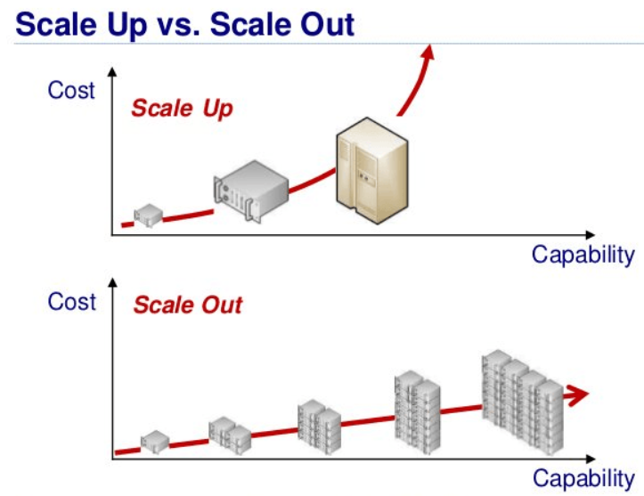

# 📌Redis
**오픈소스 인메모리 데이터 저장소로, 주로 캐싱, 세션 저장, 실시간 데이터 처리 등에 사용**
  

---

## 🚀 Redis 주요 특징
### 1️⃣ 초고속 데이터 처리
- 모든 데이터를 메모리(RAM) 에 저장하여 빠른 읽기/쓰기 성능 제공
- 캐시, 세션 저장소, 실시간 분석 등에 적합
    

### 2️⃣ 다양한 자료구조 지원
- 문자열, 리스트, 셋, 정렬된 셋, 해시, 비트맵, 하이퍼로그 등
    
### 3️⃣ 영속성(Persistence)
- Redis는 기본적으로 메모리 기반 저장소이지만, 데이터를 디스크에 저장하여 장애 발생 시 복구할 수 있음

    #### 👉 RDB (Redis Database)
    - 일정 간격마다 스냅샷(Snapshot) 을 저장하는 방식
    - 성능에 영향이 적지만, 장애 발생 시 최근 데이터 손실 가능

    #### 👉 AOF (Append Only File)
    - 모든 쓰기 연산을 로그 형태로 저장하여 장애 발생 시 복구 가능
    - 데이터 유실이 거의 없지만, 성능 오버헤드가 발생할 수 있음

    #### 👉 RDB + AOF 혼합 사용 가능!
    - RDB는 빠른 스냅샷 저장, AOF는 안전한 데이터 복구 보장
    - 일반적으로 AOF를 활성화하여 데이터 유실 방지
        

### 4️⃣ 분산 환경 지원 (Replication & Clustering)
- Redis는 단일 서버뿐만 아니라, 마스터-슬레이브 복제(Replication) 및 클러스터링(Clustering) 기능을 제공

  #### 👉 Redis Replication(복제)
  - 마스터(Master) 가 슬레이브(Slave) 에 데이터를 실시간 복제
  - 읽기 부하 분산(Read Scalability) 에 유리
  - 슬레이브 서버가 마스터 장애 시 대체 가능 (Failover)
  
  #### 👉 Redis Cluster(클러스터)
  - 데이터를 여러 노드에 자동 분산 저장
  - Sharding(샤딩) 지원: 데이터를 키 범위에 따라 나눠 저장
  - 대량의 데이터를 처리할 때 유용
      

---

##  📌 SQL vs NoSQL
| 특징 | SQL (관계형 데이터베이스) | NoSQL (비관계형 데이터베이스) |
|------|--------------------|----------------------|
| **데이터 모델** | 테이블 기반 (행과 열) | 문서, 키-값, 그래프, 컬럼 기반 |
| **스키마** | 고정된 스키마 (Schema) 필요 | 유연한 스키마, 동적 구조 |
| **확장성** | 수직 확장 (Scale-Up) | 수평 확장 (Scale-Out) |
| **트랜잭션** | ACID 지원 (강력한 일관성) | BASE 모델 (궁극적 일관성) |
| **데이터 구조** | 정형 데이터 (Structured) | 반정형/비정형 데이터도 지원 |
| **복잡한 쿼리** | JOIN, GROUP BY 등 강력한 쿼리 지원 | 일반적으로 단순한 조회에 최적화 |
| **사용 사례** | 금융, ERP, CRM 등 | 소셜 미디어, 빅데이터, IoT 등 |
| **대표 DB** | MySQL, PostgreSQL, Oracle, MS SQL | MongoDB, Redis, Cassandra, DynamoDB |

  

---
##  📌 수직 확장 vs. 수평 확장

| 구분 | 수직 확장 (Scale-Up) | 수평 확장 (Scale-Out) |
|------|--------------------|----------------------|
| **방식** | 기존 서버 성능 업그레이드 | 서버 여러 대 추가 |
| **확장성** | 제한적 (하드웨어 한계) | 뛰어남 (서버 추가 가능) |
| **비용** | 고성능 장비 비용이 높음 | 상대적으로 저렴 (저사양 서버 다수 운영) |
| **성능** | 단일 서버 성능 향상 | 부하 분산으로 전체 처리량 증가 |
| **유지보수** | 간단함 (서버 1대 관리) | 복잡함 (로드 밸런서, 클러스터 관리 필요) |
| **장애 대응** | 단일 장애점(SPOF) 존재 | 일부 서버 다운 시에도 서비스 유지 가능 |
| **사용 사례** | 금융, ERP 등 강한 일관성이 필요한 시스템 | SNS, 검색 엔진, 클라우드 서비스 |

  

---

1️⃣
2️⃣
3️⃣
4️⃣
5️⃣
6️⃣
7️⃣
8️⃣
9️⃣