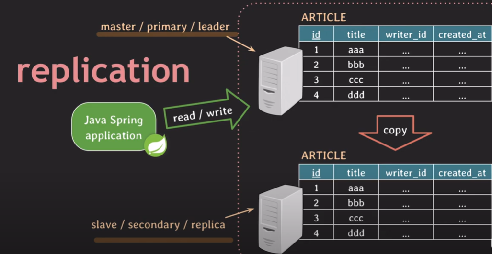
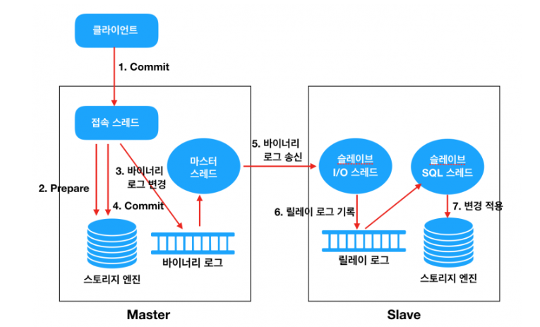

# 📌Replication
- **데이터베이스(DB)에서 데이터를 복제하여 여러 개의 복사본을 유지하는 기술**
- **읽기 부하를 분산하거나 장애 발생 시 백업 역할을 수행**
    
---

### 🏷️ Primary (Master)
- 원본 데이터가 저장되는 주 데이터베이스
### 🏷️ Replica (Secondary, Slave) 
- Primary DB의 데이터를 복제하는 데이터베이스

💡 보통 Primary DB는 데이터를 읽고 쓰는 역할을 하지만, Replica DB는 주로 읽기 전용(Read-Only)으로 사용

  

---
## 📌 레플리카의 주요 목적
1️⃣ **읽기 부하 분산**
- 다수의 사용자가 데이터를 조회할 때, Replica DB가 부담을 나눠 가져 성능을 향상시킴
    
2️⃣ **고가용성(High Availability)**
- Primary DB가 장애가 발생하면 Replica DB를 Primary로 승격(Failover)하여 서비스 지속 가능
    
3️⃣ **백업 및 복구**
- Primary DB의 데이터를 보호하고, 실수로 데이터가 삭제되었을 때 복구 가능
    
4️⃣ **데이터 분석 분리**
- 분석용 쿼리를 Replica DB에서 실행하여 Primary DB의 성능을 유지
  

---

## 📌 레플리카 유형 
1️⃣ **비동기 복제 (Asynchronous Replication)**
- Primary DB에서 변경 사항이 발생하면 즉시 Replica로 전송하지 않고 일정 시간 간격을 두고 반영
- 장점: 성능이 빠름, Primary DB에 미치는 영향 적음
- 단점: 장애 발생 시 데이터 유실 가능성 있음
  

2️⃣ **동기 복제 (Synchronous Replication)**
- Primary DB의 변경 사항이 Replica DB에 완전히 반영된 후에만 트랜잭션이 완료됨
- 장점: 데이터 일관성이 유지됨 (데이터 유실 가능성 없음)
- 단점: 속도가 느릴 수 있음, Primary DB의 성능에 영향
    

---

## 📌 마리아디비의 복제
✅ **MariaDB는 기본적으로 비동기 복제(Asynchronous Replication)를 사용**
- Master는 Binary Log에 변경 사항을 기록하고, Slave는 이를 가져와 적용하는 방식
- Master는 Slave가 데이터를 받았는지 기다리지 않고 즉시 다음 작업을 수행
- Slave가 데이터 복제를 완료하기 전에 Master가 장애가 발생하면, 일부 데이터가 유실될 가능성이 있음
    

---
## 📌 비동기 복제 방식 원리

  
    1️⃣ 클라이언트에서 Commit 을 수행
    2️⃣ 접속스레드는 스토리지 엔진에게 해당 트랜잭션에 대한 Commit 준비
    3️⃣ Commit 을 수행하기 전에 먼저 Binary Log 에 변경사항을 기록
    4️⃣ 스토리지 엔진에게 트랜잭션 Commit 을 수행
    5️⃣ Master Thread 는 시간에 구애받지 않고(비동기적으로) Binary Log 를 읽어서 Slave 로 전송
    6️⃣ Slave 의 I/O Thread 는 Master 로부터 수신한 변경 데이터를 Relay Log 에 기록 (기록하는 방식은 Master 의 Binary Log 와 동일)
    7️⃣ Slave 의 SQL Thread 는 Relay Log 에 기록된 변경 데이터를 읽어서 스토리지 엔진에 적용

#### 💡Binary Log
- **MySQL 서버에서 Create, Alter, Drop과 같은 작업을 수행하면 MySQL은 그 변화된 이벤트를 기록하는데 이러한 변경사항들에 대한 정보를 담고 있는 이진 파일을 바이너리 로그 파일**

 
