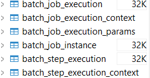
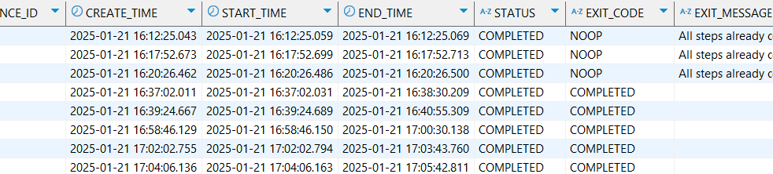

# 📌 Spring Batch 

- **대용량 데이터 처리를 위해 설계된 Spring 기반의 배치 처리 프레임워크입니다. 대량의 데이터를 효율적으로 읽고, 변환하고, 저장할 수 있도록 다양한 기능을 제공**

---

## 📌 스프링 배치의 주요 개념
### 1️⃣ Job
- 하나의 배치 작업 단위
- 여러 개의 Step으로 구성됨
    

### 2️⃣ Step
- 배치 작업의 세부 단위
- 보통 하나의 Step은 읽기(Reader) → 처리(Processor) → 쓰기(Writer) 과정으로 구성됨
- TaskletStep과 ChunkStep 두 가지 유형이 있음
    
### 3️⃣ JobLauncher
- 배치 작업을 실행하는 역할
- JobLauncher.run(Job, JobParameters)를 호출하여 실행
    
### 4️⃣ JobRepository
- 배치 작업의 실행 정보, 상태 등을 저장하는 저장소
    
### 5️⃣ ItemReader
- 데이터를 읽는 역할
- 예시: JDBC, JPA, Flat 파일(CSV, XML), Kafka 등
    
### 6️⃣ ItemProcessor
- 데이터를 가공하는 역할
- 예시: 필터링, 데이터 변환, 로직 적용 등
    
### 7️⃣ ItemWriter
- 데이터를 저장하는 역할
- 예시: 데이터베이스, 파일, API 호출 등

  

---

## 📌 스프링 배치의 동작 흐름

1️⃣ JobLauncher가 Job을 실행

2️⃣ Job은 여러 개의 Step을 실행

3️⃣ 각 Step은 ItemReader → ItemProcessor → ItemWriter 순으로 실행

4️⃣ JobRepository에 실행 상태를 저장

6️⃣ 성공 또는 실패 여부를 JobExecutionListener로 감지

  

---

## 📌 스프링 배치와 일반 배치

### 1️⃣ 트랜잭션 관리
   - 일반 배치: 트랜잭션 관리를 직접 코드로 구현해야 하며, 중간에 실패하면 롤백을 직접 처리해야 함.
   - 스프링 배치: Step 단위에서 자동 트랜잭션 관리가 가능하며, 실패 시 자동 롤백 기능 제공.
       
### 2️⃣ 재시작 및 실패 처리
   - 일반 배치: 중간에 실패하면 처음부터 다시 실행해야 하며, 별도의 상태 관리가 필요.
   - 스프링 배치: JobRepository가 실행 상태를 관리하여 실패한 지점부터 재시작 가능.
       
### 3️⃣ 병렬 처리
- 일반 배치: 쓰레드 풀(Thread Pool) 등을 직접 구현해야 함.
- 스프링 배치: TaskExecutor 및 ParallelStep 등을 활용하여 손쉽게 병렬 처리 가능.
    

### 4️⃣ 로그 및 모니터링
- 일반 배치: 수동으로 로그를 남겨야 하며, 별도 로그 시스템 구축 필요.
- 스프링 배치: JobRepository를 통해 실행 상태 저장 및 Spring Batch Admin 등의 도구로 모니터링 가능.

- 실제로 디비에 접속해서 보면 배치 처리에 대한 자세한 로그 확인 가능

### 5️⃣ 데이터 처리 방식
- 일반 배치: while 루프 등을 사용하여 데이터를 하나씩 읽고 처리.
- 스프링 배치: ItemReader → ItemProcessor → ItemWriter 구조를 제공하여 효율적 처리 가능.

### 6️⃣ 확장성과 유지보수
- 일반 배치: 코드 수정이 어려우며, 새로운 기능 추가가 어렵다.
- 스프링 배치: 설정만 변경하여 다양한 데이터 소스와 확장 가능.

### 💡 정리
| 일반 배치 | 스프링 배치 |
|----------|------------|
| 간단한 작업에는 적합 | 대량 데이터 처리에 적합 |
| 트랜잭션, 오류 처리 직접 구현 필요 | 자동 트랜잭션 및 재시작 기능 지원 |
| 모니터링 기능 없음 | `JobRepository`를 통한 모니터링 가능 |
| 유지보수 어려움 | 설정 변경만으로 확장 가능 |

