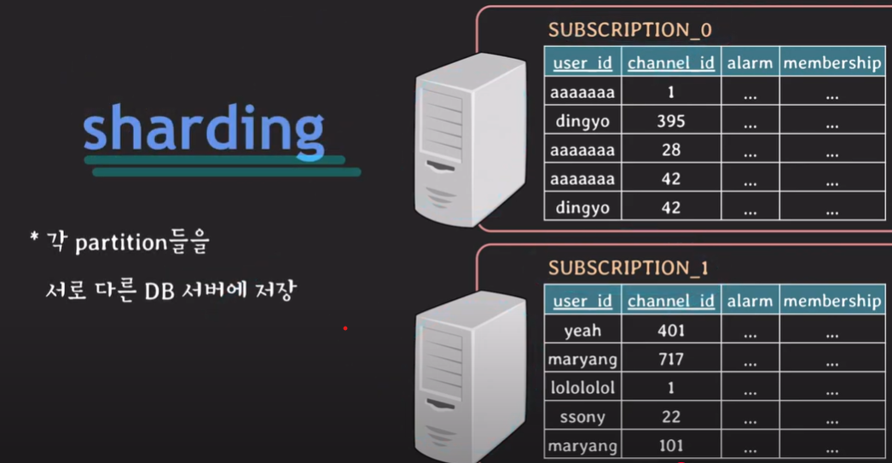

# 📌Sharding
- **데이터베이스의 데이터를 여러 개의 작은 데이터베이스(Shard)로 분할하여 저장**
- **샤딩은 수평 파티셔닝의 일종**
- **수평적 파티셔닝은 동일한 DB 서버 내에서 테이블을 분할하는 것이고
  샤딩은 DB 서버를 분할한다는 것**
- **쉽게 말해 쓰기 분할** 
    
---

## 📌샤딩의 목적 
1️⃣ **성능 문제 해결** 

- 데이터가 너무 많아지면 단일 데이터베이스에서 처리하는 데 한계가 발생함.
- 샤딩을 하면 쿼리를 여러 개의 데이터베이스로 분산시켜서 처리 속도를 높일 수 있음.

2️⃣ **트래픽 부하 분산** 

- 하나의 데이터베이스에 요청이 몰리면 병목 현상이 발생할 수 있음.
- 샤딩을 하면 각 Shard가 독립적으로 동작하므로, 부하를 나눌 수 있음.

3️⃣ **확장성(Scalability)** 

- 단일 서버에서 처리할 수 있는 데이터 용량에는 물리적 한계가 있음.
- 샤딩을 하면 새로운 Shard를 추가하는 것만으로 데이터 용량을 쉽게 확장 가능.

  

## 📌샤딩의 종류

### 1️⃣ 키 기반 샤딩 (Key-Based Sharding)
- 특정 컬럼(예: user_id)의 해시 값(Hash)을 계산하여 특정 Shard로 분배하는 방식.
- Shard = Hash(user_id) % 총 Shard 개수
- 예제:
  - user_id = 101 → Shard 1
  - user_id = 205 → Shard 2
  - user_id = 310 → Shard 3

- **장점**: 데이터가 고르게 분배됨
- **단점**: Shard 개수를 변경하면 데이터를 재분배해야 함

  

### 2️⃣ 범위 기반 샤딩 (Range-Based Sharding)
- 특정 값의 범위를 기준으로 샤딩하는 방식
- 예제:
  - user_id 1~1000 → Shard 1
  - user_id 1001~2000 → Shard 2
  - user_id 2001~3000 → Shard 3

- **장점**: 특정 범위의 데이터를 쉽게 조회 가능
- **단점**: 데이터 불균형 문제가 발생할 수 있음 (특정 Shard에 데이터가 몰릴 위험)

  

### 3️⃣ 지리적 샤딩 (Geographical Sharding)
- 사용자의 위치(지역)별로 데이터를 분산
- 예제:
  - 한국 사용자 → Shard 1
  - 미국 사용자 → Shard 2
  - 유럽 사용자 → Shard 3

- **장점**: 각 지역의 데이터 처리 속도를 향상
- **단점**: 글로벌 서비스에서 특정 지역의 트래픽이 몰릴 가능성

---

