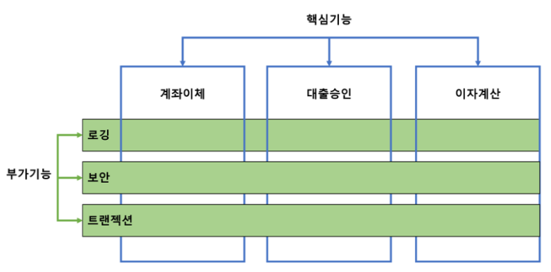
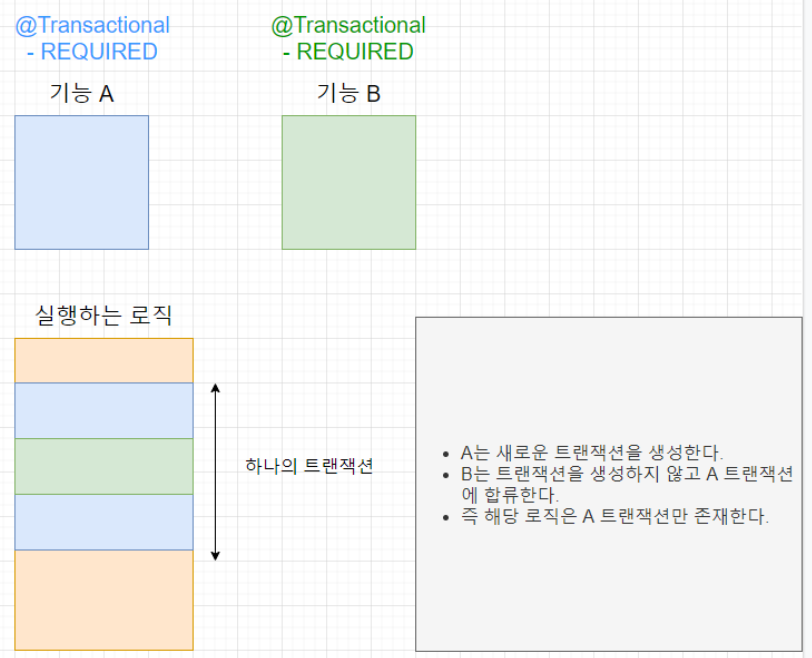
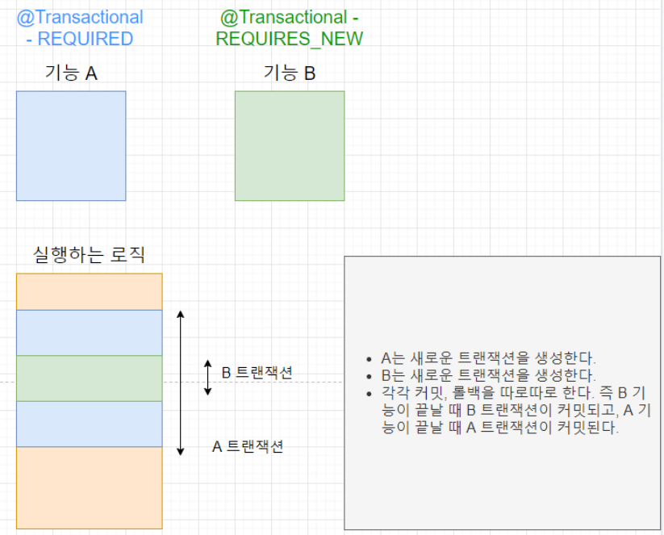
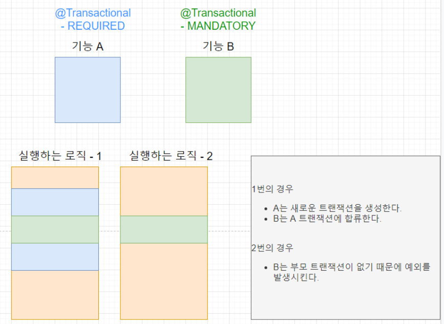
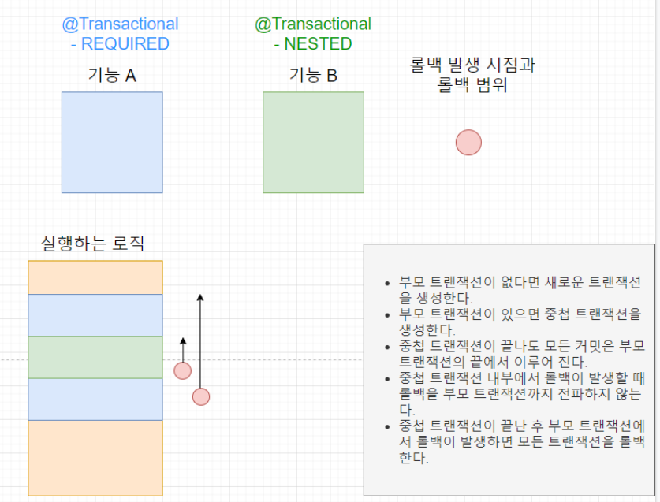

# 📌 @Transactional


- **트랜잭션(Transaction)을 관리하는 데 사용**
- **데이터베이스 연산(INSERT, UPDATE, DELETE 등) 중 오류가 발생하면 자동으로 롤백하고, 정상적으로 수행되면 커밋하는 기능을 제공**
  <br><br>


## 📌 AOP와 Transactional
- AOP 기반으로 작동하는 트랜잭션 처리 담당.
- 특정 메소드나 클래스에 붙이면 해당하는 놈이 트랜잭션 처리가 됨.
- AOP로 작동하기 때문에 실제 원본 객체가 아닌 프록시(가짜) 객체 생성.
- 원래있던 놈을 감싸서 프록시 객체로 작동하는 거임
- 그럼 왜 프록시 객체를 쓸까?
  <br><br>

### ❓ AOP란? 


- AOP란 **횡단 관심사** 임.  
- 그림 처럼 여러 기능들이 있을거고. 그 기능들은 각각 핵심 기능을 가지고 있을거임. 본인이 뭔 기능을 할지.
- 그런데 꼭 핵심기능만 있는것이 아닌 공통된 부가 기능도 있음. 보안. 트랜잭션. 실행시간 등등.
- 근데 공통된 부가기능을 모두 각각에 다 달아놓으면 어케 되겠음. 우선 중복이 오지고. 수정도 힘듬. 하나 바꿀라면 다 설정해놔서 다 바꿔야됨.
- 그래서 이런 공통된 기능등을 따로 빼서 횡단 관심사로 빼두는거임 그냥 그림 처럼 가로로 그려져 있어서 횡단관심사라 한다. 생각하면 됨.
- 그럼 왜 AOP는 프록시 객체를 쓸까. 간단함 원본을 유지하기 위함임. 핵심 기능이있는 원본은 건들지 않고 프록시 객체를 통해 원본을 감싸서 처리함. 

<br><br>

### ⚠️ Transactional 사용시 주의 사항 
#### 1️⃣ private 메서드에는 적용되지 않음
- 프록시 객체는 원본 객체를 감싸서 작동한다 했는데 이 뜻은 결국 프록시는 원본을 상속 받는다는 의미임. 
- **프록시 extends 원본** 
- 이 의미인데 private 상속 안되어서 트랜잭션 붙여도 동작 안함.

<br><br>

#### 2️⃣ 같은 클래스 내에서 메서드 호출 시 적용되지 않음

```java
@Service
public class MyService {

    @Transactional
    public void methodA() {
        
        methodB(); // 메소드B는 메소드A의 트랜잭션 안에서 동작
    }
    
    public void methodB() {
    
    }
}


```

- 위의 코드를 보면 메소드A에만 트랜잭션 처리를 해둠. 메소드A 안에서 메소드 B를 호출하면 메소드 B도 같이 트랜잭션 처리가 됨. A의 트랜잭션에 들어오는 거임.

<br><br>

```java
@Service
public class MyService {

    @Transactional
    public void methodA() {
        
    }

    
    public void methodB() {
        methodA(); // 트랜잭션이 적용되지 않음 this.methodA()이므로.
    }
}


```
- 반대로 메소드B안에서 메소드 A를 실행하면 트랜잭션 처리가 안됨. 
- 왜냐하면 메소드A를 호출할때 앞에는 this. 이 생략되어있음. 
- This는 자기 자신을 가리키는 놈임. 그래서 프록시 객체가 아닌 원본 객체를 가르키고 있기 때문에 트랜잭션 처리가 안됨. 
- 트랜잭션 처리는 프록시 객체를 통해서 작동하게 되어있음. 이게 트랜잭션 애노테이션에서 주의해야할 사항중 하나임.
- 이런 경우 메소드 A의 트랜잭션을 제대로 돌리고 싶다면. 메소드 A를 외부 클래스로 빼버리면 됨. 그러면 외부클래스.methodA() 로 호출하고 methodA에 트랜잭션 처리를 해두면 그때 프록시 객체를 통해 트랜잭션 처리를 함. 
- 아니면 그냥 바깥에 있는 메소드인 methodB에 트랜잭션 처리를 하거나.

<br><br>

#### ❓ 그럼 만약 메소드A랑, 메소드B에 모두 트랜잭션이 붙어있다면 어떻게 동작을 할까


```java
@Service
public class MyService {

    @Transactional
    public void methodA() {
        methodB(); // 메소드B의 트랜잭션은 메소드A의 트랜잭션에 합류.
    }

    @Transactional
    public void methodB() {
        
    }
}
```

- 위의 경우 메소드B의 트랜잭션은 메소드A의 트랜잭션에 합류한다. 
- 서로 다른 트랜잭션으로 돌아가는것이 아니라 하나의 트랜잭션으로 돌아감. 그래서 중간에 오류나면 싹다 롤백된다.
  이와 같은 거를 **트랜잭션 전파** 라고 함. 
- 한 트랜잭션 경계에서 다른 트랜잭션에 대한 처리를 어떻게 할지를 뜻함.

<br><br>

### ❓ 트랜잭션 전파란? 
#### 1️⃣ REQUIRED (기본 값)
- 이미 진행 중인 트랜잭션이 없으면 새로 시작하고, 진행 중인 트랜잭션이 있다면 기존 트랜잭션에 참여.

  <br><br>
#### 2️⃣ REQUIRES_NEW
- 항상 새로운 트랜잭션을 시작하는 방식
- 앞에 시작된 트랜잭션의 존재 유무와 상관 없이 새로운 트랜잭션을 만들어 독립적으로 동작 
- 독립적인 트랜잭션이 보장되어야 하는 코드에 적용할 수 있음


<br><br>
#### 3️⃣ MANDATORY
- 이미 진행 중인 트랜잭션이 있으면 해당 트랜잭션에 합류
- 만약 진행 중인 트랜잭션이 없다면 예외를 발생시킨다는 것이 REQUIRED와 다른 점
- 독립적인 트랜잭션을 생성하면 안되는 경우에 사용

  <br><br>
#### 4️⃣ NESTED
- 이미 실행 중인 트랜잭션이 존재한다면, 중첩 트랜잭션을 만듬
- 중첩 트랜잭션이란 트랜잭션 내부에 다시 트랜잭션을 만드는 것이다. 즉, 부모 트랜잭션에서 새로운 트랜잭션을 내부에 만듬
- 중첩 트랜잭션은 부모 트랜잭션의 커밋과 롤백에는 영향을 받지만, 중첩 트랜잭션 자기 자신은 부모 트랜잭션에 영향을 주지 않음
- REQUIRED와 마찬가지로 부모 트랜잭션이 존재하지 않으면 독립적으로 트랜잭션을 생성해서 사용

  <br><br>


### 💡 정리 
| 전파 속성           | 설명 | 기존 트랜잭션 존재 여부 | 동작 방식 |
|----------------------|------------------------|--------------------|---------------------------|
| **`REQUIRED`** (기본값) | 기존 트랜잭션이 있으면 참여, 없으면 새 트랜잭션 생성 | 존재 시 참여, 없으면 새로 생성 | 대부분의 경우 사용 |
| **`REQUIRES_NEW`** | 기존 트랜잭션이 있어도 무조건 새로운 트랜잭션 생성 | 항상 새로운 트랜잭션 | 기존 트랜잭션을 잠시 보류 |
| **`MANDATORY`** | 반드시 기존 트랜잭션 내에서 실행 (없으면 예외 발생) | 없으면 `Exception` 발생 | 기존 트랜잭션이 필수인 경우 |
| **`NESTED`** | 기존 트랜잭션이 있으면 중첩 트랜잭션 생성 | 존재 시 중첩 트랜잭션 | 별도의 롤백이 가능 |
| **`SUPPORTS`** | 기존 트랜잭션이 있으면 참여, 없으면 트랜잭션 없이 실행 | 존재 시 참여, 없으면 없음 | 트랜잭션이 필수가 아닌 경우 |
| **`NOT_SUPPORTED`** | 트랜잭션 없이 실행 (기존 트랜잭션이 있으면 일시 정지) | 항상 트랜잭션 없이 실행 | 트랜잭션이 필요 없는 경우 |
| **`NEVER`** | 트랜잭션 없이 실행 (기존 트랜잭션이 있으면 예외 발생) | 있으면 `Exception` 발생 | 트랜잭션을 원하지 않는 경우 |


