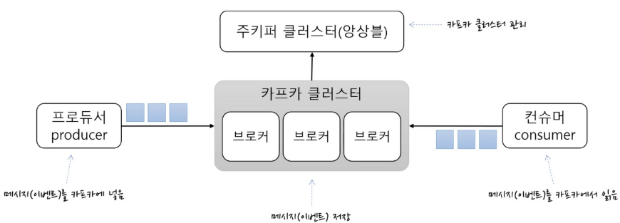
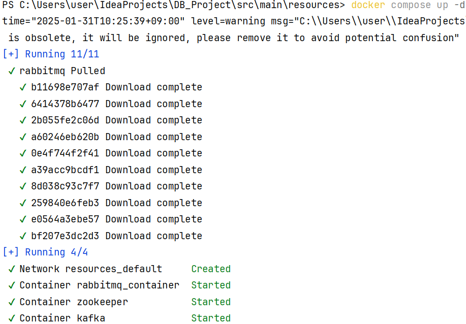
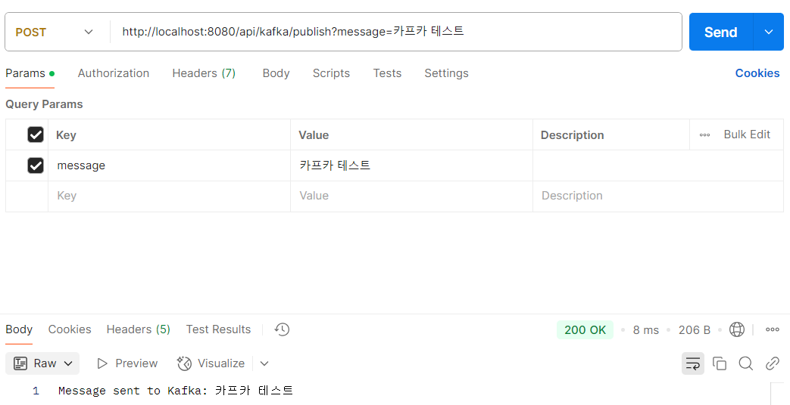
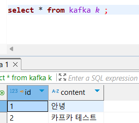

# 📌Kafka


- **분산 메시지 스트리밍 플랫폼으로, 대량의 데이터를 빠르고 안정적으로 처리하는 시스템**
- 메모리 저장방식의 RabbitMQ와 다르게 디스크에 저장하여 메모리 유실이 없음

---




### 1️⃣ 토픽(Topic)
**Kafka에서 데이터가 저장되는 논리적 단위**
- Producer가 메시지를 보내고, Consumer가 가져감
- 프로듀서는 메시지를 특정 토픽에 발행하고, 컨슈머는 토픽을 구독하여 메시지를 소비
- 데이터는 특정 기간 동안 유지됨 (기본 7일)
- 여러 파티션으로 나눠질수 있고 이를 통해 병렬 처리 가능
  <br><br>

### 2️⃣ 프로듀서(Producer)
**Kafka에 데이터를 전송하는 역할**
- Push 방식으로 메시지를 특정 토픽으로 보냄
- 데이터가 여러 개의 파티션(Partition) 으로 분산됨
- Acknowledge 설정에 따라 메시지 전송 보장 수준 조절 가능
  <br><br>

### 3️⃣ 컨슈머(Consumer)
**Kafka에서 데이터를 읽어오는 역할**


- Pull 방식 (데이터 소비자가 직접 데이터를 요청하여 가져가는 방식) 으로 메시지를 가져감
- 오프셋(Offset) 기반으로 메시지 읽기 위치 관리
- Topic의 파티션은 컨슈머그룹과 1:N 매칭 관계로 동일 그룹내 한 개의 컨슈머만 연결가능
- 이로써 파티션의 메시지는 순서대로 처리되도록 보장
  <br><br>

### 4️⃣ 파티션(Partition)
**토픽을 여러 개의 작은 단위로 나눈 것**
- 데이터를 병렬로 처리 가능 (확장성 증가)
- 같은 키(예: orderId)를 가진 메시지는 항상 같은 파티션으로 전송됨
- 파티션은 메시지 추가만 가능한 파일(append-only)
  <br><br>

### 5️⃣ 브로커(Broker)
**Kafka 클러스터를 구성하는 서버 노드**
- 하나의 Kafka 클러스터에는 여러 개의 브로커가 있음
- 각 브로커는 특정 파티션을 저장 및 관리
  <br><br>

### 6️⃣ ZooKeeper
**Kafka의 메타데이터를 관리하는 서비스**
- 브로커와 토픽 정보를 유지
- Kafka의 리더 선출 및 클러스터 상태 관리
- ZooKeeper 의존성이 강해 Kafka 3.0부터 Zookeeper 없이 KRaft(Kafka Raft) 사용 가능
  <br><br>

---
<br><br>
## 📌 Kafka 작동 방식
1️⃣ Producer가 특정 토픽으로 메시지 전송 <br>
2️⃣ Kafka Broker가 메시지를 받아 파티션에 저장 <br>
3️⃣ Consumer가 메시지를 읽어 처리 <br>

🚀 Kafka는 메시지를 단순히 "전달"하는 게 아니라, 메시지를 "보관"하면서 여러 Consumer가 가져갈 수 있도록 함!

<br><br>

---
<br><br>
## 📌 왜 Kafka를 쓸까?

### 1️⃣ 높은 처리량 & 빠른 속도 (High Throughput & Low Latency)
- 초당 수백만 건의 메시지 처리 가능 (배치 전송 & 압축 가능)
- 디스크 기반 저장이지만 Zero Copy 기술로 빠르게 처리
- 하드웨어 리소스를 최소화하면서도 높은 성능 제공
<br><br>

### 2️⃣ 확장성 (Scalability)
- 분산 아키텍처를 기반으로 설계됨
- Broker를 추가하면 자동으로 부하 분산 (Cluster 확장 가능)
- 데이터 처리량이 증가해도 쉽게 확장 가능
  <br><br>

### 3️⃣ 내구성 (Durability) & 데이터 유실 방지
- 데이터를 하드디스크에 저장하여 장애 발생 시에도 복구 가능
- Replication (복제) 기능으로 하나의 Broker가 죽어도 데이터 손실 없음
  <br><br>

### 4️⃣ 데이터 스트리밍 & 실시간 처리 (Real-time Streaming)
- 데이터를 실시간으로 소비 가능 (Low Latency)
  <br><br>

### 5️⃣ Pull 방식으로 소비자가 부하 조절 가능
- Consumer가 필요한 만큼 데이터를 가져갈 수 있음 (Pull 방식)
- RabbitMQ처럼 푸시하면 과부하 발생 가능, Kafka는 이를 방지
  <br><br><br><br>

---
<br><br>
### 🎯 Kafka를 꼭 사용해야 하는 경우
- ✅ 대량의 데이터를 빠르고 안정적으로 처리해야 할 때
- ✅ 장애가 발생해도 데이터 손실이 없어야 할 때
- ✅ 마이크로서비스 아키텍처에서 이벤트 기반으로 연동할 때
- ✅ 로그 데이터, 실시간 분석, 스트리밍 데이터 처리가 필요할 때
  <br><br>
---
<br><br>
### 🎯 Kafka를 안 써도 되는 경우
- ❌ 간단한 메시징 시스템이 필요할 때 (RabbitMQ, Redis Pub/Sub이 더 적합)
- ❌ 데이터의 실시간성이 매우 중요한 경우 (WebSocket 같은 실시간 푸시가 필요할 때)
- ❌ 소규모 프로젝트에서 설정이 복잡할 때 (Kafka는 설정 & 운영이 어려움)
  <br><br>
---
<br><br>
## 📌 도커로 Kafka 테스트 해보기
### 1️⃣ 도커 설치, yml 파일 설정 

- docker-compese.yml 파일을 작성한뒤 터미널에서 해당 파일이 있는 곳 까지 이동 
- docker compose up -d 으로 실행
- docker compose down 으로 종료
- 주키퍼와 카프카가 시작된것 확인
  <br><br>

### 2️⃣ KafkaProducer

```
@Service
@RequiredArgsConstructor
public class KafkaProducer {
    private final KafkaTemplate<String, String> kafkaTemplate;

    // application.yml에서 설정한 토픽 값을 가져옴
    @Value("${spring.kafka.topic}")
    private String topic;
    
    public void sendMessage(String message) {
        kafkaTemplate.send(topic, message);
    }
}
```

- 간단하게 토픽생성해서 메세지 보냄
  <br><br>

### 3️⃣ KafkaConsumer

```
@Service
@RequiredArgsConstructor
public class KafkaConsumer{
    private final KafkaRepository kafkaRepository;

    @KafkaListener(topics = "test-topic", groupId = "kafka-group")
    public void consumeMessage(String message) {
        KafkaEntity kafka = new KafkaEntity();
        kafka.setContent(message);
        kafkaRepository.save(kafka);
        System.out.println("Consumed and saved message: " + message);
    }
}
```

- 컨슈머는 토픽과 그룹아이디로 메세지를 읽어옴
- 읽어온 메세지 디비에 따로 저장
  <br><br>

### 4️⃣ KafkaController

```
@RestController
@RequestMapping("/api/kafka")
@RequiredArgsConstructor
public class KafkaController {
    private final KafkaProducer kafkaProducer;

    @PostMapping("/publish")
    public String publish(@RequestParam String message) {
        kafkaProducer.sendMessage(message);
        return "Message sent to Kafka: " + message;
    }
}
```

- 컨트롤러를 통해 프로듀서 실행
  <br><br>


### 5️⃣ PostMan 으로 데이터 던져보기 


<br><br>

### 6️⃣ DB확인

<br><br>

---


