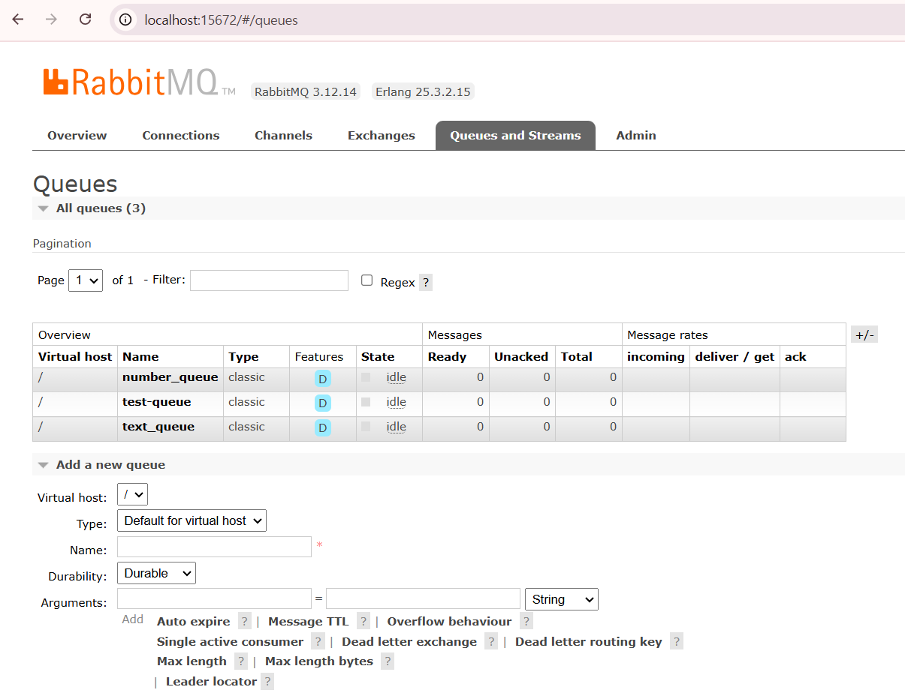
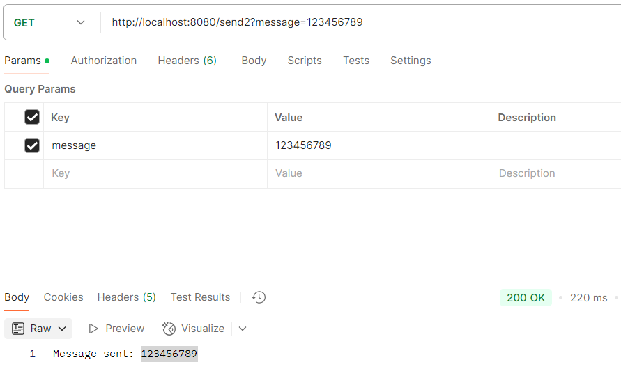
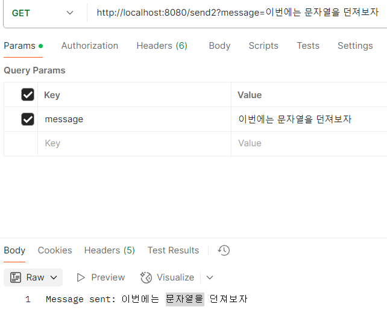

# 📌 RabbitMQ
**메시지 브로커(Message Broker) 또는 메시지 큐(Message Queue) 역할**

**시스템 간 데이터를 비동기적으로 전달하여 비효율적인 동기 호출 문제를 해결하는 데 사용**

<br>
💡 비동기 메시징이란?

- 하나의 애플리케이션이 다른 애플리케이션과 직접 통신하지 않고, 메시지를 큐(queue)에 저장한 뒤 필요할 때 가져가는 방식
- 예제: 주문 시스템에서 주문 데이터를 메시지 큐에 넣으면, 결제 시스템이 이를 가져가서 처리하는 방식.
  <br><br>
---

## 📌 RabbitMQ의 주요 개념


### 1️⃣ Producer (생산자)
- 메시지를 생성하여 큐(Queue)에 전송하는 역할
- 예제: 사용자가 결제 요청을 하면, 결제 데이터를 메시지 큐에 보냄


### 2️⃣ Queue (큐)
- 메시지를 저장하는 공간이며, Consumer(소비자)가 메시지를 가져갈 때까지 유지
- 여러 개의 큐를 만들 수 있으며, 서로 다른 용도로 사용할 수도 있음


### 3️⃣ Consumer (소비자)
- 큐에서 메시지를 가져와 처리하는 애플리케이션입니다.
- 예제: 결제 시스템이 큐에서 데이터를 읽고 결제를 수행함.


### 4️⃣ Exchange (교환기)
- Producer가 보낸 메시지를 적절한 Queue로 라우팅하는 역할
- Exchange에는 여러 유형이 있으며, 메시지를 어떻게 전달할지를 결정

  | 타입    | 설명 |
  |---------|------------------------------------------------|
  | **Direct**  | 라우팅 키가 정확히 일치하는 Queue에 메시지 전송 |
  | **Topic**   | 라우팅 키 패턴이 일치하는 Queue에 메시지 전송 |
  | **Headers** | `[key:value]`로 이루어진 header 값을 기준으로 일치하는 Queue에 메시지 전송 |
  | **Fanout**  | 해당 Exchange에 등록된 모든 Queue에 메시지 전송 |


### 5️⃣ Binding (바인딩)
- Exchange와 Queue를 연결
- 특정 규칙(바인딩 키)에 따라 메시지를 특정 큐로 보낼 수 있음


### 6️⃣ Routing Key (라우팅 키)
- Exchange가 메시지를 특정 Queue로 보내는 기준이 되는 키
- 특정 조건에 맞는 메시지만 특정 Queue로 전달할 수 있음

<br><br>

---

## 📌 RabbitMQ 메시지 전달 과정

1️⃣ **Producer(생산자)** 가 메시지를 생성하여 **Exchange(교환기)** 로 보냄.

2️⃣ **Exchange** 는 Routing Key를 기반으로 적절한 **Queue(큐)** 로 메시지를 전달함.

3️⃣ **Consumer(소비자)** 는 Queue에서 메시지를 가져와 처리함.

🚀 비동기적인 구조이기 때문에 Producer는 메시지를 보내고 바로 다른 작업을 수행할 수 있음.
즉, Consumer가 메시지를 처리할 때까지 기다릴 필요가 없음.

<br><br>

---

## 📌 RabbitMQ 테스트

### 1️⃣ RabbitMQConfig

```
@Configuration
public class RabbitMQConfig {

    // Exchange 이름
    private static final String EXCHANGE_NAME = "message_exchange";

    // Queue 이름
    private static final String NUMBER_QUEUE = "number_queue";
    private static final String TEXT_QUEUE = "text_queue";

    // Exchange 생성
    @Bean
    public DirectExchange messageExchange() {
        return new DirectExchange(EXCHANGE_NAME);
    }

    // 숫자 큐 생성
    @Bean
    public Queue numberQueue() {
        return new Queue(NUMBER_QUEUE);
    }

    // 문자 큐 생성
    @Bean
    public Queue textQueue() {
        return new Queue(TEXT_QUEUE);
    }

    // 숫자 큐와 바인딩
    @Bean
    public Binding bindNumberQueue(Queue numberQueue, DirectExchange messageExchange) {
        return BindingBuilder.bind(numberQueue).to(messageExchange).with("number");
    }

    // 문자 큐와 바인딩
    @Bean
    public Binding bindTextQueue(Queue textQueue, DirectExchange messageExchange) {
        return BindingBuilder.bind(textQueue).to(messageExchange).with("text");
    }
}


```

입력받은 문자열이 숫자인지 문자인지에 따라 각각 숫자 큐와 문자 큐에 저장하도록 하는 Config 파일

<br><br>
### 2️⃣ Producer

```
@RestController
@RequiredArgsConstructor
public class MessageProducer2 {

    private final RabbitTemplate rabbitTemplate;

    private static final String EXCHANGE_NAME = "message_exchange";

    @GetMapping("/send2")
    public String sendMessage(@RequestParam String message) {
        String routingKey;

        // 숫자 메시지인지 확인
        if (message.matches("\\d+")) { // 숫자로만 이루어진 경우
            routingKey = "number";
        } else { // 문자 메시지인 경우
            routingKey = "text";
        }

        // 메시지 전송
        rabbitTemplate.convertAndSend(EXCHANGE_NAME, routingKey, message);
        System.out.println("Sent message: " + message + " to routing key: " + routingKey);
        return "Message sent: " + message;
    }
}
```

<br><br>
### 3️⃣ Consumer

```
@Service
public class MessageConsumer2 {

    @RabbitListener(queues = "number_queue")
    public void handleNumberMessage(String message) {
        System.out.println("Received number message: " + message);
        // 숫자 메시지 처리 로직
    }

    @RabbitListener(queues = "text_queue")
    public void handleTextMessage(String message) {
        System.out.println("Received text message: " + message);
        // 문자 메시지 처리 로직
    }
}

```
<br><br>
### 4️⃣ RabbitMQ http://localhost:15672/ 접속




- 아이디, 비번 guest 로 접속하면 RabbitMQ에 대한 정보를 쉽게 시각화 되어 있어 볼수 있음.
- Queue, Exchange 등의 정보 확인 가능. 큐 추가도 가능

<br><br>
### 5️⃣ PostMan으로 데이터 던져보기 



- 숫자만 던졌을 경우 라우팅 키가 number 로 되면서 해당 큐로 전송됨.
  <br><br>





- 문자열을 던졌을때도 마찬가지로 잘 작동함.

---